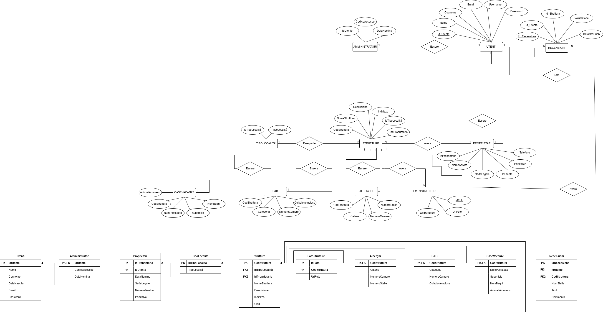

# OpinioniVacanze

## Descrizione del progetto

OpinioniVacanze è una piattaforma web sviluppata in PHP e MySQL che permette agli utenti di cercare, visualizzare e recensire strutture turistiche come alberghi, B&B e case vacanze.

Il progetto include:
- autenticazione utenti
- autenticazione proprietari
- pannello amministratore
- gestione strutture
- sistema recensioni
- dashboard statistiche
- ricerca dinamica con filtri

# Tecnologie utilizzate

- PHP
- MySQL
- HTML
- CSS
- JavaScript

# Funzionalità principali

## Utenti
- Registrazione e login
- Completamento profilo personale
- Ricerca strutture
- Filtri per tipologia e località
- Inserimento recensioni
- Visualizzazione recensioni personali

## Proprietari
- Registrazione proprietario
- Login proprietario
- Inserimento strutture
- Gestione strutture
- Inserimento foto strutture

## Amministratori
- Accesso protetto tramite codice amministratore
- Dashboard backend dedicata
- Gestione strutture
- Eliminazione recensioni
- Visualizzazione statistiche piattaforma

# Database

Il database contiene le seguenti tabelle principali:

- Utenti
- Proprietari
- Amministratori
- Strutture
- Alberghi
- BnB
- CaseVacanze
- FotoStrutture
- Recensioni
- TipoLocalità

# Diagramma ER e schema logico

# Sicurezza implementata

- Prepared Statements con PDO
- Protezione SQL Injection
- Password hashate tramite `password_hash()`
- Verifica password con `password_verify()`
- Controllo sessioni per pagine protette
- Separazione ruoli:
  - utente
  - proprietario
  - amministratore

# Ricerca e filtri

La homepage include:
- ricerca automatica dinamica
- filtro per tipologia struttura
- filtro per località

La ricerca viene aggiornata automaticamente durante la digitazione.

# Area amministratore

L’area amministratore è separata dal frontend principale del sito.

L’accesso avviene tramite:
1. login utente
2. verifica ruolo amministratore
3. inserimento codice amministratore
4. accesso dashboard backend

Funzionalità disponibili:
- gestione strutture
- eliminazione strutture
- gestione recensioni
- eliminazione recensioni
- statistiche piattaforma